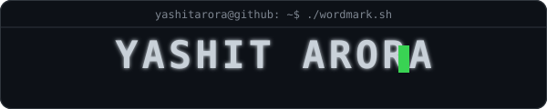

<div align="center">

<!-- HERO SECTION -->
<!-- GitHub strips most inline styles. Using a simple table for layout. -->
<table>
  <tr>
    <td align="center" width="45%">
      
    </td>
    <td align="center" width="55%">
      
      <br>
      <b><u>yashit@github:~$ AI/ML · DATA · SOFTWARE ENGINEERING</u></b><br>
      <i>Building intelligent systems from data, models and software.</i>
      <br><br>
      <a href="https://yashitarora.github.io"></a>
      <a href="https://www.linkedin.com/in/yashit-arora-75977328a"></a>
      <a href="mailto:arorayashit22@gmail.com"></a>
      <a href="Resume.pdf"></a>
    </td>
  </tr>
</table>

<br>
</div>

---

### 💻 System Information
`> whoami`
```text
name        : Yashit Arora
role        : Computer Science Student
focus       : AI/ML | Data Analytics | Software Engineering
education   : B.Tech Computer Science
institute   : Thapar Institute of Engineering & Technology
location    : India
interests   : AI, ML, data, software systems
open_to     : Internships | Collaborations | Opportunities
```

`> about_me --verbose`
> I am a Computer Science student dedicated to bridging the gap between raw data and intelligent applications. My work focuses on **Machine Learning**, **Predictive Analytics**, and **Software Engineering**, with a particular interest in time-series forecasting and anomaly detection for industrial systems. I enjoy solving real-world problems by building end-to-end pipelines—from feature engineering and model development to deploying scalable applications.

`> tech_stack --list`
- **Languages & Core**: `Python`, `C++`, `SQL`, `PL/SQL`, `Linux`, `Git`
- **Data & ML**: `Pandas`, `NumPy`, `Scikit-learn`, `PyTorch`, `LightGBM`, `NLP`, `TF-IDF`
- **Deployment & Tools**: `Streamlit`, `FastAPI`, `Docker`, `GitHub`
- **Specializations**: `Machine Learning`, `Time-Series Forecasting`, `Anomaly Detection`, `Predictive Analytics`, `Data Analytics`, `Feature Engineering`, `Database Systems`

---

### 🚀 Featured Projects
`> ls projects/featured`

| Project | Description | Link |
| :--- | :--- | :--- |
| ⚡ **NES Smart Meter** | Industrial analytics for forecasting & anomaly detection. <br> **Metrics:** MAPE: 0.72%, R²: 0.9997 | [View Project →](https://github.com/yashitarora/nes-smart-meter-analytics) |
| 🔌 **MeterIQ** | Explainable analytics for theft risk & load forecasting. <br> **Tech:** Python, ML, Data | [View Project →](https://github.com/yashitarora/ucs503p-202627odd-MeterIQ) |
| ✈️ **Aircraft RUL** | Predictive maintenance using NASA C-MAPSS data. <br> **Tech:** Gradient Boosting | [View Project →](https://github.com/yashitarora/RUL_AIRCRAFT_ENGINE_PREDICITION) |
| 🧠 **EmotionSense** | NLP emotion classifier with Streamlit UI. <br> **Acc:** 86.38%, F1: 0.81 | [View Project →](https://github.com/yashitarora/nlp-emotion-app) |
| 🤖 **JARVIS-AI** | Voice-driven AI assistant with NLP & automation. <br> **Tech:** Python, NLP, API | [View Project →](https://github.com/yashitarora/JARVIS-AI) |
| 🏢 **Smart Building** | IoT energy analytics using K-Means & PCA. <br> **Data:** 50K+ points | [View Project →](https://github.com/yashitarora/SMART-BIULDINGS_ENERGY_USAGE) |

---

### 📈 Experience & Education
`> experience --current`
- **Machine Learning Intern** | NES Technologies
  - Worked with real-world industrial smart-meter data.
  - Implemented predictive analytics and anomaly detection.
  - Conducted extensive feature engineering and model development.

`> education --info`
- **Thapar Institute of Engineering & Technology**
  - B.Tech Computer Science | 2024 – 2028

`> journey --map`
`Fundamentals` $\rightarrow$ `DSA + DBMS + C++ + Python` $\rightarrow$ `Machine Learning` $\rightarrow$ `Data Analytics` $\rightarrow$ `Industrial Data` $\rightarrow$ `End-to-End Apps` $\rightarrow$ `Software Engineering` $\rightarrow$ `Advanced AI`

---

### 📊 Contribution Graph
`> github_contributions --graph`
<div align="center">
  
</div>

---

### ☕ Beyond Code
`> beyond_code`
> Exploring new technologies, solving complex puzzles, building side projects, and learning the internals of AI systems.

<div align="center">
  <br>
  <code>Build. Learn. Solve. Repeat.</code>
</div>
